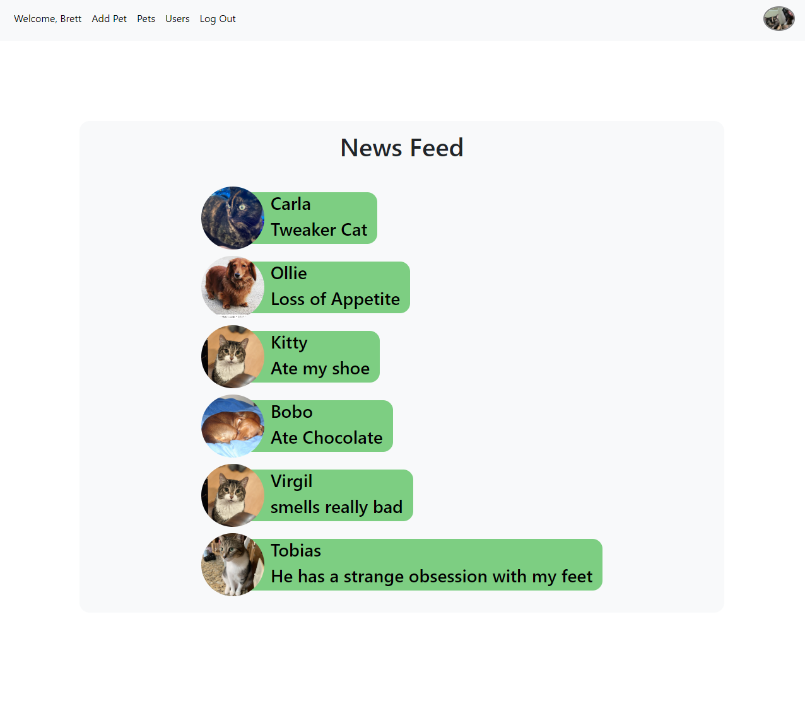
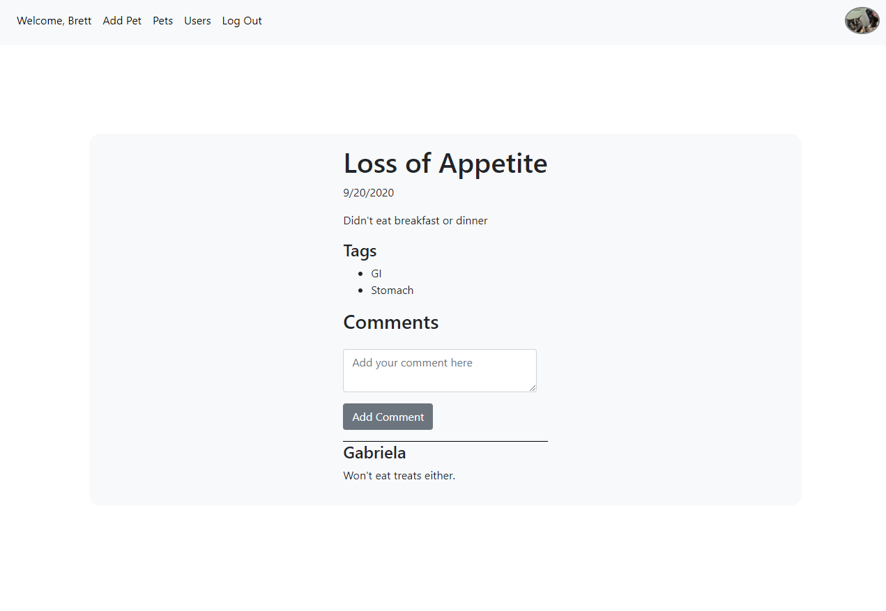
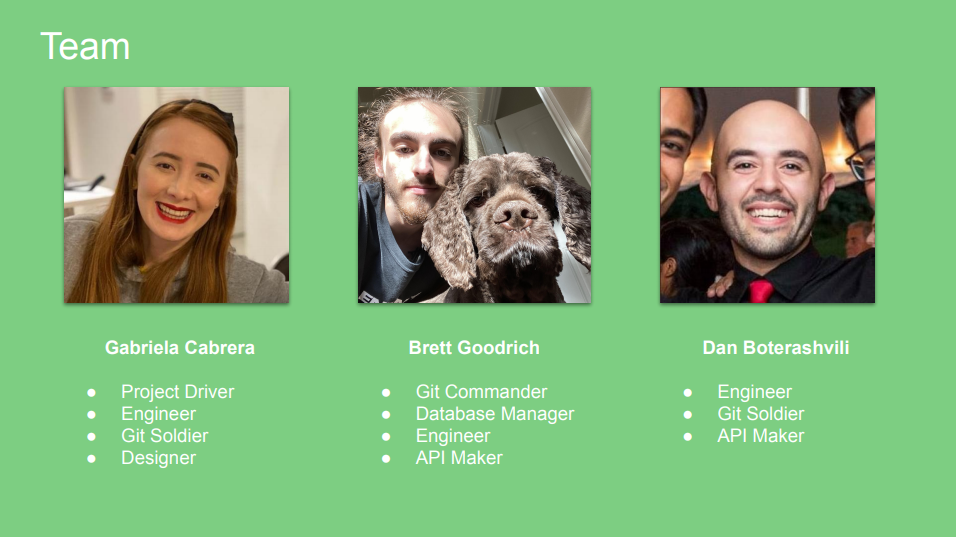

# PetLink

## [PetLink Deployed](https://pet-link.herokuapp.com/)

## Project Inspiration

The health of our pets is very important. They cannot communicate the same way we do so it is our responsibility as pet owners to stay vigilant of any symptoms and track suspicious behaviors carefully.

Unfortunately, this is not as easy as it sounds. Some symptoms may go unnoticed if we don't know what they mean, or may only appear every once in a while making it difficult to track any triggers that might be causing them.

In most cases, online articles can shed light on what might be happening with your pet, but wouldn't it be nice if there was a better way to find, or even exchange, relevant information related to your pet’s health with people going through the same experiences as you, or with vets that can guide you?

## Technologies Used

-   HTML, CSS, JavaScript
-   NodeJs
-   ExpressJs
-   JWT Auth
-   Mongoose
-   MongoDB
-   React
-   HERE Maps
-   AWS-SDK
-   Multer

## User Stories

-   AAU I would like to edit my pet's Information
-   AAU I would like to log my pet's behaviors
-   AAU I would like to log my pet's symptoms
-   AAU I would like to see my current posts
-   AAU I would like to see my archived posts in a separate page
-   AAU I would like to mark behaviors and symptoms as private or public
-   AAU I would like to see other people's comments on my posts
-   AAU I would like to search for pets by their location, type, breed, age, illness, allergies or all of the above
-   AAU I would like to follow pets of my choosing
-   AAU I would like to see a news feed of the recent activity of the dogs I follow
-   AAU I would like to comment on other people's posts

## Stretch Goals:

-   Make a fully functioning Progressive Web Application
-   Add conditional pop up notifactions to help user remember important tasks
-   Improve Map Functionality 

## Entity Relationship Diagram

## Wireframes

## Trello Board

https://trello.com/b/RMwu1OSV/petlink-20

## The Team

